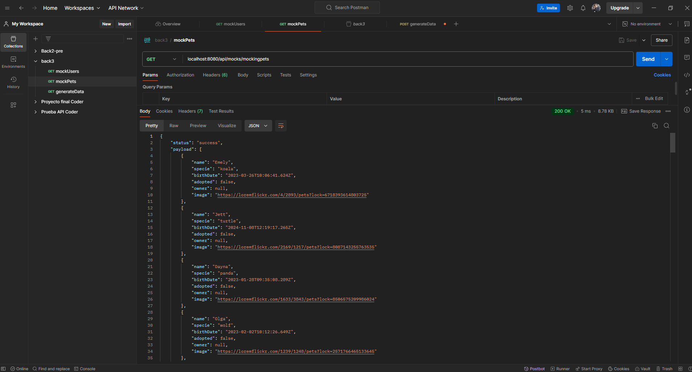
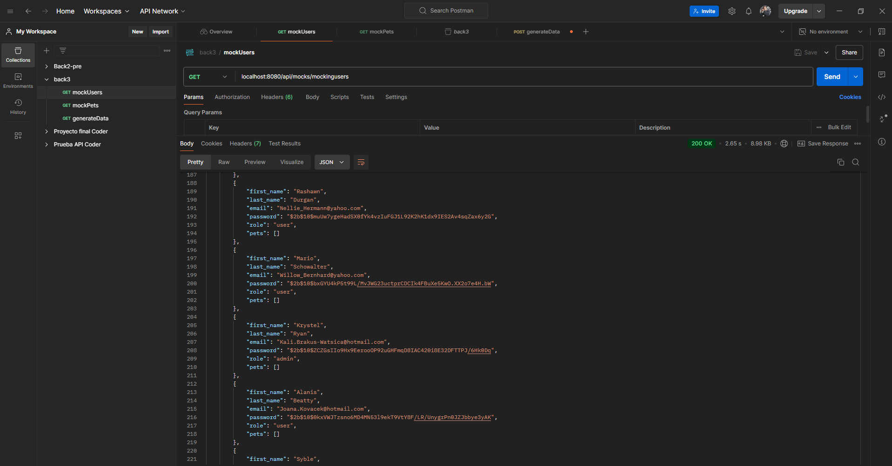
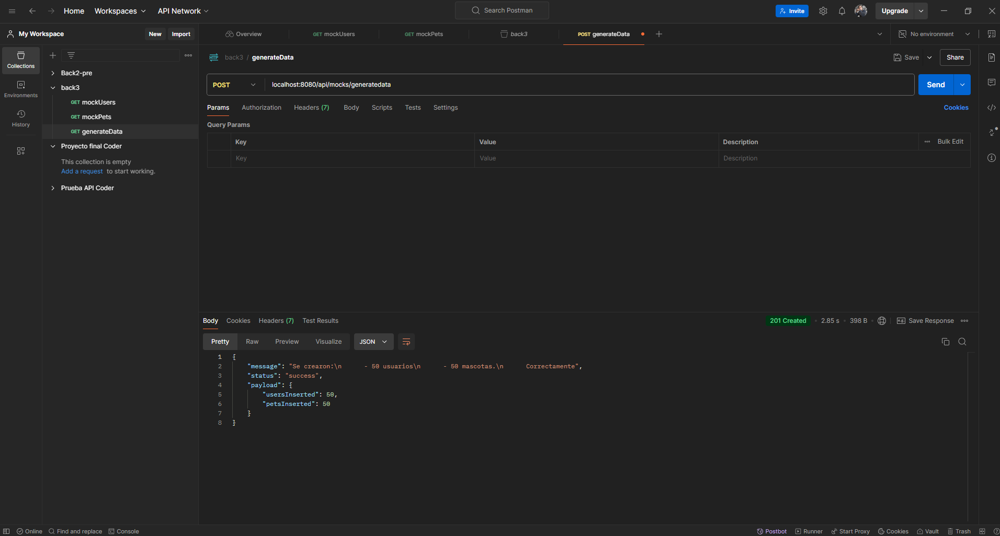
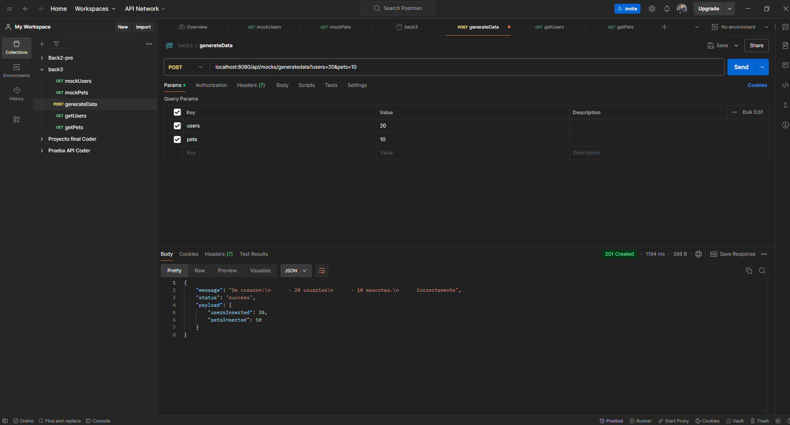
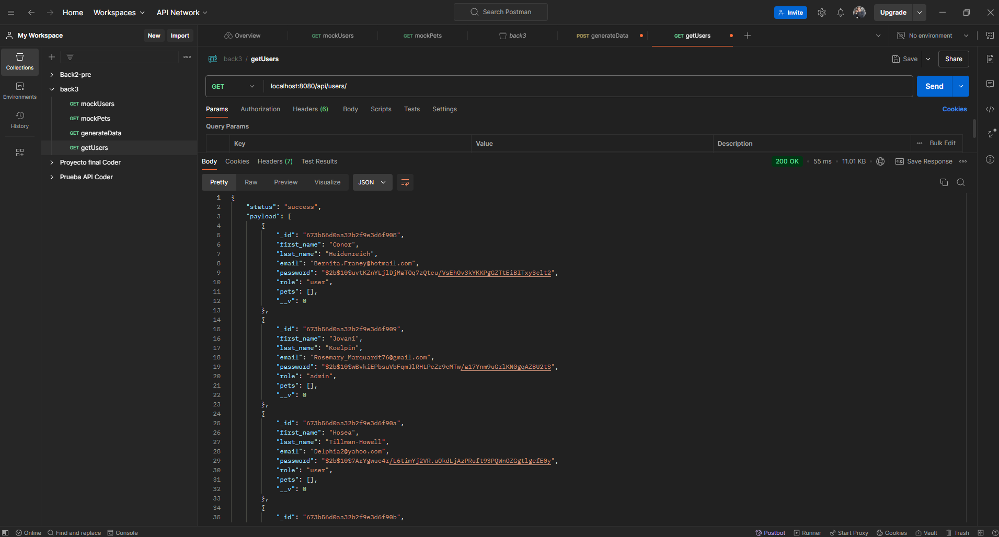
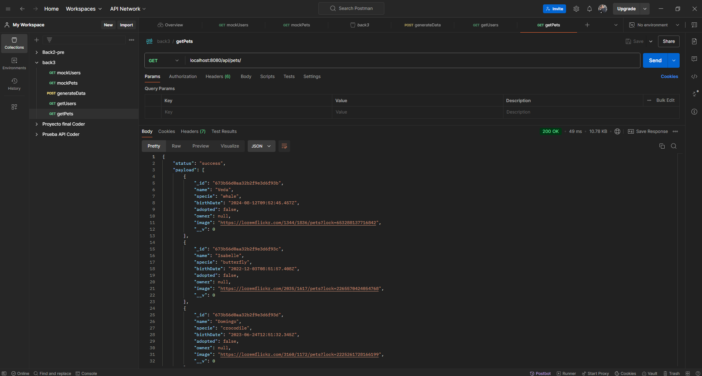
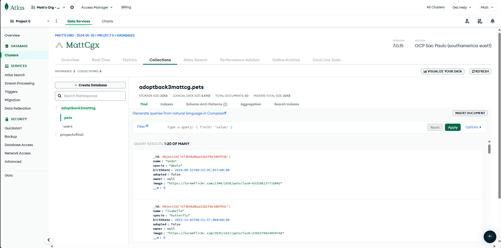
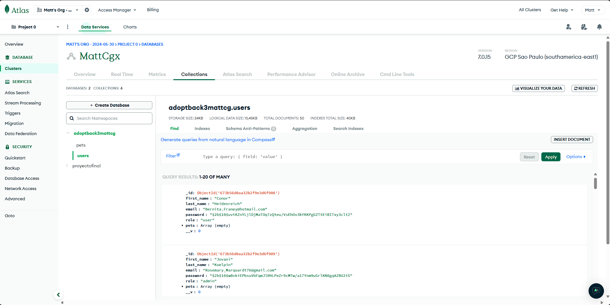

# PreEntrega 1:
## Backend III - Coderhouse - Comision 70075

### CONSIGNAS

- Crear un router llamado mocks.router.js que funcione bajo la ruta base /api/mocks. Que incluya el endpoint “/mockingpets” dentro de este router.

- Crear un módulo de Mocking para generar usuarios de acuerdo a un parámetro numérico. Dichos usuarios generados deberán tener las siguientes características:
    En “password” debe tener la contraseña “coder123” encriptada.
    “role” puede variar entre “user” y “admin”.
    “pets” debe ir como array vacío.

- Dentro del router mocks.router.js, utilizar este módulo en un endpoint GET llamado “/mockingusers”, y generar 50 usuarios con el mismo formato que entregaría una petición de Mongo.

- Dentro del router mocks.router.js, desarrollar un endpoint POST llamado /generateData que reciba los parámetros numéricos “users” y “pets” para generar e insertar en la base de datos la cantidad de registros indicados.

- Comprobar dichos registros insertados mediante los servicios GET de users y pets.

- Realizar Test de los endpoints de Adoptions con supertest, mocha y Chai.

- Documentar el modulo Users con Swagger

- Crear una imagen de docker del proyecto y subirla a Dockerhub.
-----------

### Para resolver la preentrega se generan los endpoints:

- **GET** /api/mocks/mockingpets (Acepta parametro numérico `quantity` default 50)
- **GET** /api/mocks/mockingusers (Acepta parametro numérico `quantity` default 50)
- **POST** /api/mocks/generateData (Acepta parametros numéricos `users` y `pets` default 50, ambos)
- **GET** /api/users
- **GET** /api/pets

### Las Variables de entorno se encuentran en:
- Detalle de la entrega en la plataforma de coderhouse
- Archivo `.envPreentrega` dentro del repositorio (renombrar como `.env` para su correcto funcionamiento)

### El servidor se incia con:
- `npm run start`

### La imagen de Docker se llama con:

- `docker pull mattcg/pets`

-----------

## Capturas de pantalla de los diferentes endpoints funcionando:

- /api/mocks/mockingpets

_________________

- /api/mocks/mockingusers

_________________

- /api/mocks/generateData + generateData con parámetros diferentes al default

_________________

- /api/users

_________________

- /api/pets

_________________

## Capturas de la base de datos con los datos insertados

- Coleccion Pets

- Colección Users

_________________